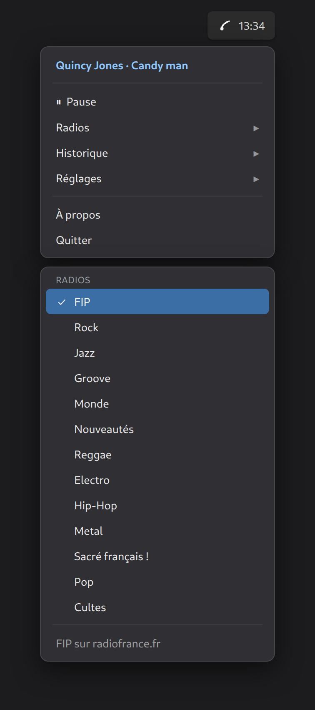

# le fipindicateur

[](https://github.com/PLNech/fipindicateur/actions/workflows/ci.yml)

A tiny system-tray app to listen to **FIP** (Radio France) webradios. Pick a
station, see who you're hearing, play/pause from the tray or your media keys.
Unofficial client.

Linux (Ubuntu 24.04, GNOME/X11) is the supported target today. macOS and Arch
are kept buildable and planned.



> The image above is a **mockup render** of the menu, not a live screenshot.
> Real tray screenshot pending (TODO): GNOME's tray menu can't be captured
> headlessly.

## What it does

- **13 FIP webradios**: FIP, Rock, Jazz, Groove, Monde, Nouveautés, Reggae,
  Electro, Hip-Hop, Metal, Sacré français !, Pop, Cultes.
- **Now playing**: artist and title, live, from Radio France's metadata (with
  an ICY stream-title fallback). Click the track to open the artist's
  **Wikipédia article**: the app cleans the credit string down to the primary
  artist (Radio France's curated `highlightedArtists` when present, else the
  credit cut at the first separator), resolves it via the opensearch API on
  fr.wikipedia then en.wikipedia (niche artists often live on en only), and
  falls back to the fr search page, so a click never dead-ends. The « Voir… »
  submenu also offers the Radio France music link (often Apple Music) as a
  secondary option. When no artist is known, a DuckDuckGo search steps in.
- **Play / pause**: for live radio, pause is a full stop and play rejoins the
  live edge (no stale buffer).
- **Historique**: the last ten tracks you heard, click to reopen.
- **Réglages**: high quality (AAC 192k), notifications, launch at login, local
  history log.
- **MPRIS2**: controllable with `playerctl` and desktop media keys; shows
  track and cover in your desktop's media widget. The Volume property is
  read/write, so `playerctl volume 0.5` works and the menu follows.
- **Volume, one knob**: the tray submenu (Muet + 10/25/50/75/100 % presets)
  drives the app's **PulseAudio stream volume** (mpv `ao-volume`), the same
  per-app slider pavucontrol and GNOME show. Adjust it there and the menu +
  MPRIS follow. PulseAudio itself remembers the level across restarts
  (module-stream-restore); the app never overwrites it at startup, and only
  an explicit preset click, Muet, or MPRIS write touches the stream.
- **Desktop notifications** on track change, with cover art, crediting the
  album, year and label when known.
- **Icône animée**: while playing, the tray glyph becomes a 4-bar VU meter
  driven by real audio levels (mpv astats filter), with VU physics (instant
  attack, slow decay). Engineered cheap: 6 fps cap, 12 quantized levels,
  frame cache, identical frames never redrawn. Measured (pidstat, 60 s,
  hifi stream): ~6.4% of one core playing with animation vs ~4.8% without,
  so the animation itself costs ~1.6%; the bulk is mpv's audio decoding.
  Toggle in Réglages, on by default.
- **Historique local (opt-in, off by default)**: append every track change to
  `~/.local/share/fipindicateur/history.jsonl`, one JSON object per line
  (`{v, ts, station, artist, title, album, year, label}`). Greppable, easy to
  post-process, and the schema can grow (likes/dislikes are planned).
- **Statistiques d'écoute (opt-in, off by default)**: a separate toggle logs
  your *actions* (play, pause, station changes, volume) to
  `~/.local/share/fipindicateur/events.jsonl`, and `fipindicateur stats` (or
  *Réglages, Statistiques, Voir le rapport*) turns them into a self-contained
  offline report: listening hours, session lengths, play/pause counts, an
  **Achievements** wall, and a **Markov graph of your radio zapping** (is it
  mostly jazz to groove, or groove to jazz?). 100% local, nothing leaves your
  machine. See it, open the data folder, or erase it (two-click confirm) from
  the same submenu; deleting only touches `events.jsonl`, never your track
  history. The report is built from the JSONL, so it is trivial to script on.

## Install

Runtime needs **libmpv** (the app links libmpv via cgo, and mpv plays the
streams).

| OS | Runtime | Build |
|----|---------|-------|
| Ubuntu / Debian | `sudo apt install libmpv2` | `sudo apt install libmpv-dev` |
| Arch | `sudo pacman -S mpv` | `sudo pacman -S mpv` |
| macOS | planned | `brew install mpv` |

Then the recommended path is a user-level desktop install (no sudo):

```sh
make install     # builds to ~/.local/bin, adds launcher + icons
make uninstall   # removes everything (binary, launcher, icons, autostart)
```

After `make install` the app appears in GNOME activities (Super, type
"fip"). Launching it while it already runs exits the second copy cleanly
(single-instance guard on the MPRIS D-Bus name).

Or just build and run in place:

```sh
go build -o fipindicateur ./cmd/fipindicateur
./fipindicateur
```

Go 1.26+ is required (see `go.mod`).

> On GNOME the system-tray (StatusNotifierItem) needs the
> **ubuntu-appindicators** extension enabled; it ships enabled on Ubuntu.

## Usage

Launch `./fipindicateur`. A broadcast-waves glyph appears in your top bar; click
it for the menu. Your last station and settings are remembered in
`~/.config/fipindicateur/config.json`.

**Launch at login:** toggle *Réglages, Lancer au démarrage* (writes
`~/.config/autostart/fipindicateur.desktop`).

**Statistiques:** enable *Réglages, Statistiques d'écoute (local)*, then
`./fipindicateur stats` (or *Voir le rapport*) opens your listening report.
`./fipindicateur stats --out report.html --no-open` just writes the file.
`./fipindicateur version` prints the running build.

**Media keys / playerctl:**

```sh
playerctl -p fipindicateur play-pause
playerctl -p fipindicateur metadata
```

### Notifications on GNOME

Stock GNOME Shell caps notification banners at roughly 4 seconds and ignores
the app's requested duration (`notif_timeout_ms` in the config, default 10000,
honored by dunst, KDE and most other daemons). On GNOME your options are:

- read missed notifications in the clock menu (they collect there), or
- install the [Notification Timeout](https://extensions.gnome.org/extension/3795/notification-timeout/)
  GNOME extension to lengthen banners system-wide.

A richer alternative (drawing our own now-playing card) is tracked in the
issues.

## Streams (verified)

All 13 icecast `midfi` (128k MP3) streams verified with `curl -sI` on
2026-07-07; every one returned **HTTP 200, `content-type: audio/mpeg`**:

| Station | slug | midfi.mp3 | livemeta id |
|---------|------|-----------|-------------|
| FIP | fip | 200 audio/mpeg | 7 |
| Rock | fiprock | 200 audio/mpeg | 64 |
| Jazz | fipjazz | 200 audio/mpeg | 65 |
| Groove | fipgroove | 200 audio/mpeg | 66 |
| Monde | fipworld | 200 audio/mpeg | 69 |
| Nouveautés | fipnouveautes | 200 audio/mpeg | 70 |
| Reggae | fipreggae | 200 audio/mpeg | 71 |
| Electro | fipelectro | 200 audio/mpeg | 74 |
| Hip-Hop | fiphiphop | 200 audio/mpeg | (ICY) |
| Metal | fipmetal | 200 audio/mpeg | 77 |
| Sacré français ! | fipsacrefrancais | 200 audio/mpeg | (ICY) |
| Pop | fippop | 200 audio/mpeg | (ICY) |
| Cultes | fipcultes | 200 audio/mpeg | (ICY) |

URL template: `https://icecast.radiofrance.fr/{slug}-{quality}.{ext}?id=radiofrance`
(quality/ext = `midfi/mp3` default, `hifi/aac` opt-in). `fipcultes` icecast is
present, so no HLS fallback is needed. The four stations without a known
livemeta id use the ICY stream-title fallback for now-playing.

## Development

```sh
make run     # build & run
make test    # go test ./...
make lint    # the exact checks CI runs (gofmt, vet, test, build, no em dashes)
make fix     # gofmt -w + go mod tidy
make icons   # regenerate the tray icons
```

CI checks formatting: run `make fix` before pushing. See `CONTRIBUTING.md`.

## Credits & attribution

**FIP / Radio France.** This is an **unofficial** client. The streams and all
now-playing metadata are the property of **Radio France**. Please listen to and
support FIP through their official channels, the
[FIP website](https://www.radiofrance.fr/fip) and the official Radio France app.
This project only points a tray menu at their public streams; it adds no
content of its own.

**Artists.** A point of this app is to surface *who you're hearing*. Every track
links out (Wikipédia first, then the Radio France music link or a search)
precisely so artists get discovered and credited, and notifications name the
album, year and label when known.

**Code lineage.**
- The **player** (libmpv cgo wrapper) and **MPRIS2** layers derive from
  [fip-player](https://github.com/DucNg/fip-player) by DucNg (WTFPL).
- The tray uses [fyne-io/systray](https://github.com/fyne-io/systray).
- D-Bus via [godbus/dbus](https://github.com/godbus/dbus).
- Thanks to the community that documented the Radio France `livemeta` endpoint,
  notably [Zopieux's gist](https://gist.github.com/Zopieux/38c9cf4b9df3af521d7be1e0b1e26bda).

## License

GPL-3.0-or-later. See [LICENSE](LICENSE). The player/MPRIS code derives from
WTFPL-licensed work, which is GPL-compatible.
