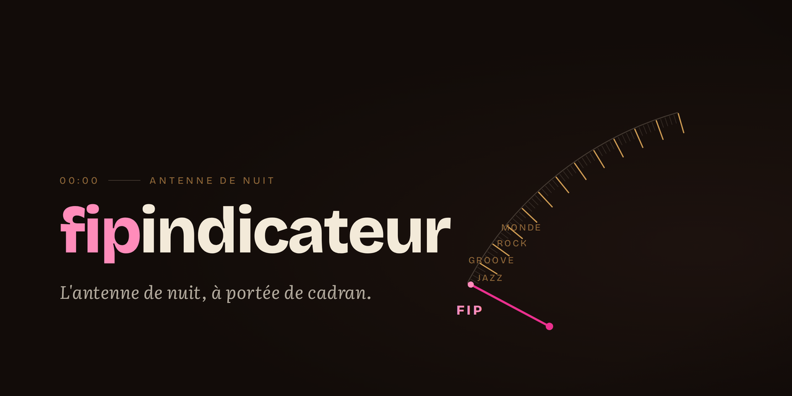
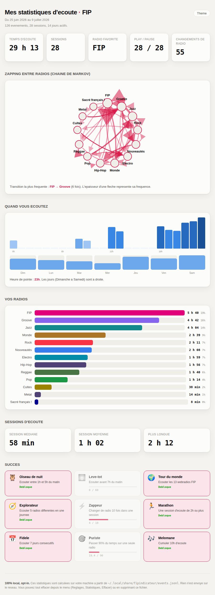

# le fipindicateur



[](https://github.com/PLNech/fipindicateur/actions/workflows/ci.yml)

**A tiny system-tray app for FIP (Radio France) webradios.**
*L'antenne de nuit, à portée de cadran.*

## What it is

Pick one of the 13 FIP stations from your tray, see who you're hearing, and
play / pause from the menu, your media keys, or `playerctl`. Turn on the opt-in,
**100% local** listening log and `fipindicateur stats` renders
**« Fin d'émission »**, a self-contained offline report of your nights: hours, a
night clock, session lengths, a Markov graph of your zapping, release-year
epochs, and a 2D artist constellation. Like or dislike the current track
straight from the tray. Nothing ever leaves your machine.

Unofficial client. Linux (Ubuntu 24.04, GNOME/X11) is the supported target;
macOS and Arch are kept buildable.

## Quick start

```sh
sudo apt install libmpv2 libmpv-dev   # Ubuntu/Debian runtime + build deps
make install                          # user-level install (binary, launcher, icons)
fipindicateur                         # or launch from GNOME activities (Super, "fip")
fipindicateur stats                   # open your listening report (after opting in)
```

## The report

<a name="privacy"></a>



> The report above is rendered from **fictional fixture data**, not anyone's real
> listening. Top to bottom: the headline totals and tuner-dial gauge, the night
> clock and weekday grid, and the **Markov graph** of station zapping (arrow
> thickness = frequency). The full page continues with release-year epochs, the
> artist constellation, label economics, taste verdicts, and an Achievements
> wall. It is theme-aware (dark and light).

**Privacy by design.** Analytics are opt-in and default off. Events are appended
to `~/.local/share/fipindicateur/events.jsonl`; the report is a self-contained
offline HTML page (no network, no CDN). See it, open the data folder, or erase
it (two-click confirm) from the same submenu. Deleting the stats log never
touches your track history, a separate consent and a separate file.

## Docs

- **[Features](docs/FEATURES.md)** : the full feature list, the FIP station
  colors, verified streams, and credits.
- **[Install & usage](docs/INSTALL.md)** : dependencies, platforms, autostart,
  updates, media keys, GNOME notifications.
- **[Development](docs/DEVELOPMENT.md)** : make targets, house style, the
  telemetry-by-design architecture, the report toolchain, `tools/enrich`.
- **[Design system](DESIGN.md)** and **[Product](PRODUCT.md)** : the
  « Fin d'émission » tokens, typography, and voice.
- **[Changelog](CHANGELOG.md)** and **[Contributing](CONTRIBUTING.md)**.

## License

GPL-3.0-or-later. See [LICENSE](LICENSE). The player / MPRIS code derives from
WTFPL-licensed work, which is GPL-compatible. FIP streams and metadata are the
property of Radio France; please support FIP through their
[official channels](https://www.radiofrance.fr/fip).
